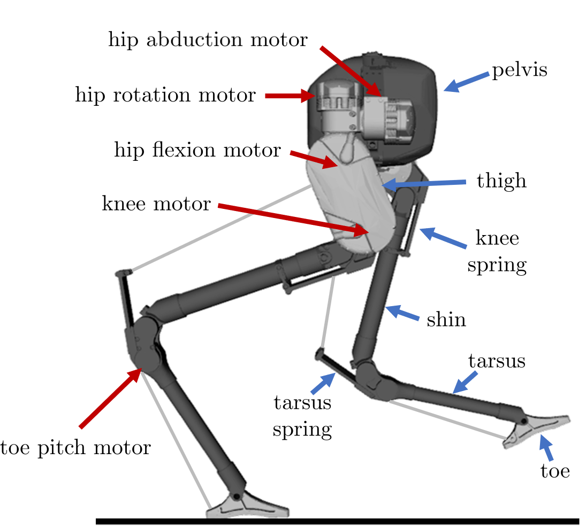

# Cassie Model
This repository can be used to generate a model of the Cassie-series robot using [FROST](http://ayonga.github.io/frost-dev/).

## Requirements
* [MATLAB 2016b or later](https://www.mathworks.com/products/matlab.html)
* [MATLAB supported compiler](https://www.mathworks.com/support/compilers.html) for generating MEX files
* [Mathematica 11](https://www.wolfram.com/mathematica/)
* [FROST](http://ayonga.github.io/frost-dev/)

## Generating Cassie's kinematics and dynamics
1. Open the `model_gen.m` script in MATLAB.
2. Modify `FROST_PATH` to reflect your FROST installation directory.
3. Generate the Cassie FROST model by runnning the first block of code, ending at line  
   `cassie = Cassie('urdf/cassie.urdf')`.
4. Run the rest of the script to generate and export various kinematic and dynamics functions.

## Cassie coordinate system

#### Base joints
* `q(1)` - x
* `q(2)` - y
* `q(3)` - z
* `q(4)` - yaw
* `q(5)` - pitch
* `q(6)` - roll

#### Left side joints
* `q(7)` - hip abduction
* `q(8)` - hip rotation
* `q(9)` - hip flexion
* `q(10)` - knee joint
* `q(11)` - knee spring (constrained to 0)
* `q(12)` - ankle joint (constrained to q12 = deg2rad(13) - q10)
* `q(13)` - toe joint

#### Right side joints
* `q(14)` - hip abduction
* `q(15)` - hip rotation
* `q(16)` - hip flexion
* `q(17)` - knee joint
* `q(18)` - knee spring (constrained to 0)
* `q(19)` - ankle joint (constrained to q19 = deg2rad(13) - q17)
* `q(20)` - toe joint

  

